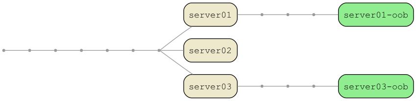
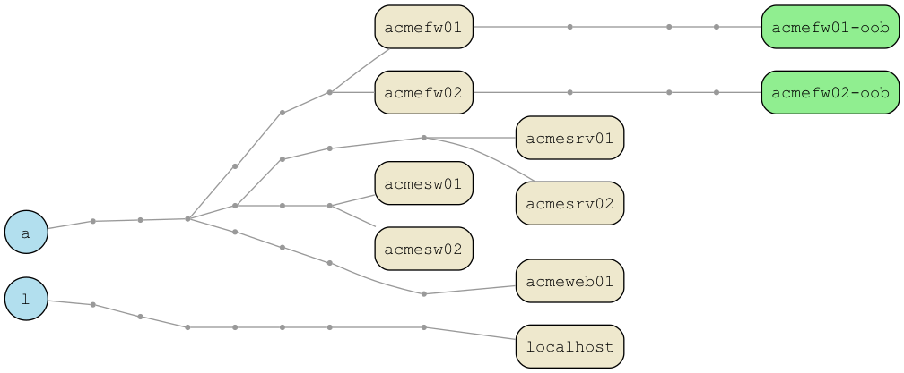
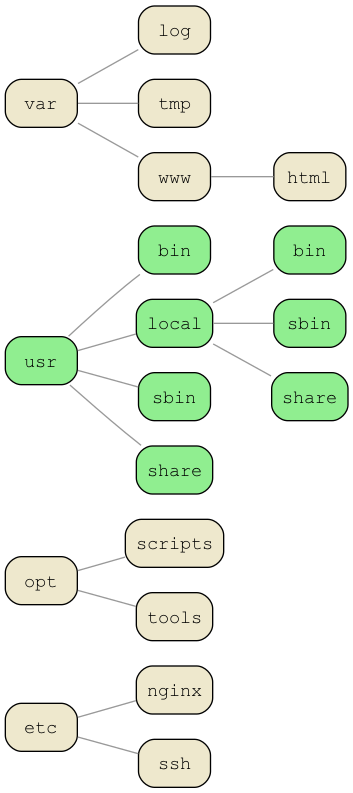
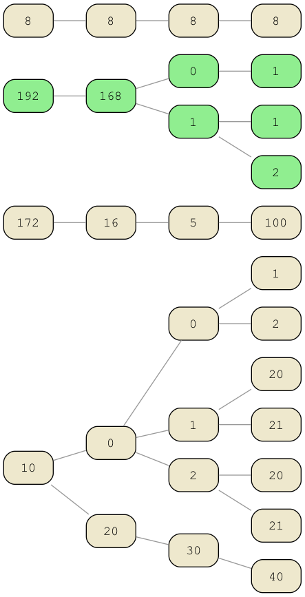

# tries

`tries` converts a list of hostnames, IPs, paths, or tokens into a
**trie** and outputs **Graphviz DOT**.

You can then use Graphviz to render the text output into PDF, PNG, SVG,
etc.

*A trie is a tree-like structure used for storing strings in a way that
exposes shared prefixes.*

It is useful for:

- Visualising naming conventions
- Discovering embedded structure in text
- Analysing patterns in hostnames, IPs, or path structures
- Documenting legacy naming schemes
- Seeing structure that is usually hidden
- Making interesting diagrams from plain text lists

There are **no Python dependencies** to produce DOT output.

**Graphviz** is needed if you want to render the DOT into PDF or PNG.



---

## Features

- Reads from files or STDIN
- Character-level trie mode
- Token mode via `-D "CHAR"`
- **Themes** (color + text presets)
- Per-node color overrides
- Per-node text color overrides
- Case-insensitive tries (`--ignore-case`)
- Windows `DOMAIN\host` prefix stripping (`--include-domain`)
- Optional FQDN stripping (`--include-fqdn`)
- Hide labels (`--no-labels`)
- Reverse token order (token mode only `--rtl`)
- Multiple sample datasets:
  - `--sample-hosts`
  - `--sample-ips`
  - `--sample-paths`
  - `--sample-urls`
  - `--sample-emails`
  - `--sample-nato`
- Automatically combines sample data + file input
- Fully standalone, no imports beyond Python stdlib
- Per-node color control
  - normal terminals
  - marked terminals
  - head node
- Per-node **text colors**
  - `text_normal`
  - `text_mark`
  - `text_head`
- Cross-platform safe font choices
- Case-insensitive filtering and marking
- Included theme-gallery generator script
- Simple `--version` flag and `--debug` output

---

## Installation

Just copy `tries.py` and optionally `themes.py` somewhere into your `$PATH`.

Requirements:

- Python 3.6+
- Graphviz (only for rendering)

macOS install:

```
brew install graphviz
```

---

## Basic Usage

Render a trie from a file:

```
./tries.py servers.txt | dot -Tpdf -o trie.pdf
```

Render PNG:

```
./tries.py servers.txt | dot -Tpng -o trie.png
```

Read from STDIN:

```
cat servers.txt | ./tries.py | dot -Tpng -o trie.png
```

Print the version and exit:

```
./tries.py --version
```

Enable debug logging:

```
./tries.py --debug file.txt
```

---

## Examples

### Hosts



This image was generated using:

```
./tries.py --sample-hosts -H -M oob \
    | dot -Tpng -o example_hosts.png
```

This example demonstrates:
- Default theme (`warm-sand`)
- Head-nodes (`-H`), which formats the head node as a circle
- Character-mode
- Marking rules (`-M`), which marks nodes with the text as a different color
- Built-in sample hosts dataset

### Paths



This image was generated using:

```
./tries.py --sample-paths -D "/" -M usr \
    | dot -Tpng -o example_paths.png
```

This example demonstrates:
- Default theme (`warm-sand`)
- Token-mode (`-D`), for delimiter-based tries (Paths)
- Marking rules (`-M`), which marks nodes with the text as a different color
- Built-in sample paths dataset

### IPs



This image was generated using:

```
./tries.py --sample-ips -D "." -M 192 \
    | dot -Tpng -o example_ips.png
```

This example demonstrates:
- Default theme (`warm-sand`)
- Token-mode (`-D`), for delimiter-based tries (IPs)
- Marking rules (`-M`), which marks nodes with the text as a different color
- Built-in sample IP dataset

### URLs


This image was generated using:

```
./tries.py --sample-urls -D "/" -M login \
    | dot -Tpng -o example_urls.png
```

This example demonstrates:
- Default theme (`warm-sand`)
- Token-mode (`-D`), for delimiter-based tries (URLs)
- Marking rules (`-M`), which marks nodes with the text as a different color
- Built-in sample url dataset

---

## Themes

Themes define all colors for:

- Normal terminal nodes
- Marked terminal nodes
- Head node (`-H`)
- Edges
- Point nodes
- Node text colors

List available themes:

```
./tries.py --list-themes
```

To use a theme, for example midnight:

```
./tries.py --sample-hosts -T midnight | dot -Tpdf -o midnight.pdf
```

Generate a gallery:

```
./generate-theme-gallery.sh
```

### Custom Themes

You can save your current color and text overrides as a reusable theme:

```
./tries.py \
    -cn lightskyblue1 \
    -cm mediumspringgreen \
    -ch royalblue3 \
    -ce cyan3 \
    -cp gray50 \
    -tn black \
    -tm black \
    -th white \
    --save-theme electric-dusk
```

This creates (or updates) `themes_custom.py` with a theme called
`electric-dusk`.

You can then use it later:

```
./tries.py --sample-hosts -T electric-dusk | dot -Tpng -o dusk.png
```

---

## Colors and Fonts

All colors used by tries.py - including theme colors and
CLI overrides - use the X11 color palette supported by Graphviz.

This means you can use any standard color name such as cornsilk2,
palegreen3, royalblue3, gray60, or lightskyblue1 without needing hex
codes.

The full list of valid color names is available here:

https://graphviz.org/doc/info/colors.html

### Theme Color Overrides

Override theme colors with:

- `-cn`, `--color-normal`
- `-cm`, `--color-mark`
- `-ch`, `--color-head`
- `-ce`, `--color-edge`
- `-cp`, `--color-point`

Example:

```
./tries.py --sample -H -T warm-sand \
    -cn mistyrose -ch skyblue \
    | dot -Tpdf -o custom.pdf
```

### Font Color Overrides

Override per-node label colors:

- `-tn`, `--text-normal`   (normal terminal)
- `-tm`, `--text-mark`     (marked terminal)
- `-th`, `--text-head`     (head node)

Example:

```
./tries.py --sample -H -T nightfall -fh black \
    | dot -Tpdf -o out.pdf
```

---

## Font Family Selection

Use a safe cross-platform font family:

- `-F courier`
- `-F courier-new`
- `-F dejavu`
- `-F liberation`
- `-F nimbus`
- `-F helvetica`
- `-F menlo`
- `-F consolas`

Example:

```
./tries.py --sample-hosts -F menlo | dot -Tpdf -o out.pdf
```

---

## Filter Input (`-f`)

Filter text via regex:

```
./tries.py -f 'fw' servers.txt
```

Filtering is case-sensitive.

### Invert Filter (`--invert-filter`)

Sometimes it’s easier to filter *out* patterns instead of matching them.

Use `--invert-filter` to keep every line **not** matching `-f`:

```
./tries.py -f 'oob' --invert-filter
```

This keeps everything *except* lines containing “oob”.

Useful for:

- excluding environments  
- excluding "oob" or "mgmt" hosts  
- excluding high-noise patterns  
- cleanup passes

---

## Marking Terminal Nodes

Use `--mark` (`-M`) with regex patterns:

```
./tries.py -M 'prod$' servers.txt
```

Multiple patterns:

```
./tries.py -M 'oob$' 'fw$' 'lm[0-9][0-9]$' servers.txt
```

Regex is case-sensitive.

---

## Head Node Rendering

To display the first character as a filled circle:

```
./tries.py -H servers.txt
```

---

## Case-Insensitive Tries (`--ignore-case`)

To treat upper and lower case as equivalent in the trie:

```
./tries.py --ignore-case servers.txt
```

This normalises internal trie IDs but keeps labels unchanged.

When `--ignore-case` is enabled:

- Internal trie nodes IDs are lowercased
- Mixed-case variants (e.g. `acmeweb01` and `ACMEWEB02`) share the same root path
- Labels retain their original case
- Prevents mixed-case duplication caused by case-only differences

When `--ignore-case` is **not** set, case is preserved in node IDs and the trie
structure is strictly case-sensitive.

---

## DOMAIN\host Prefixes

Strip:

```
ACME\server01
ACME\server02
```

Normally becomes:

```
server01
server02
```

To keep the domain:

```
./tries.py --include-domain
```

---

## Including FQDN

Input:

```
server01.domain.local
```

Default becomes:

```
server01
```

Keep the full FQDN:

```
./tries.py --include-fqdn
```

---

## Removing Labels

Remove labels from terminal and head nodes:

```
./tries.py --no-labels
```

---

### Right-to-Left Token Order (`--rtl`)

Some structured strings are naturally hierarchical from the right rather than the left

- `--rtl` only applies in **token mode** (`-D` is used)
- Useful for emails or domain names

Using token mode (`-D`), the highest-level component appears *last*, so
a normal left-to-right trie gives an inverted structure. The `--rtl`
flag fixes this by reversing the token order **after splitting**,
producing a more logical root

```
./tries.py --sample-emails -D '@' --rtl
```

---

## Sample Datasets

The sample flags are useful for:
- Testing themes
- Rendering example outputs
- Verifying colors and texts
- Ensuring Graphviz output works

```
./tries.py --sample-hosts
./tries.py --sample-ips
./tries.py --sample-paths
./tries.py --sample-urls
./tries.py --sample-nato
```

---

## Output Format

DOT output always goes to STDOUT unless `-o` is used.

Example DOT output:

```
graph tries {
  graph [fontname="Courier"];
  node  [fontname="Courier"];
  rankdir="LR";
  "a" [shape="point"];
  "ac" [shape="Mrecord", label="ac"];
  { rank = same; "a" }
  "a" -- "ac";
}
```

Render (using Graphviz):

```
dot -Tpdf -o trie.pdf
```

---

## Workflow Example

```
./tries.py servers.txt -H -T safe \
    | dot -Tpdf -o networks.pdf
```

---

## License

GPLv3 (c) David Marsh
2019–2025
